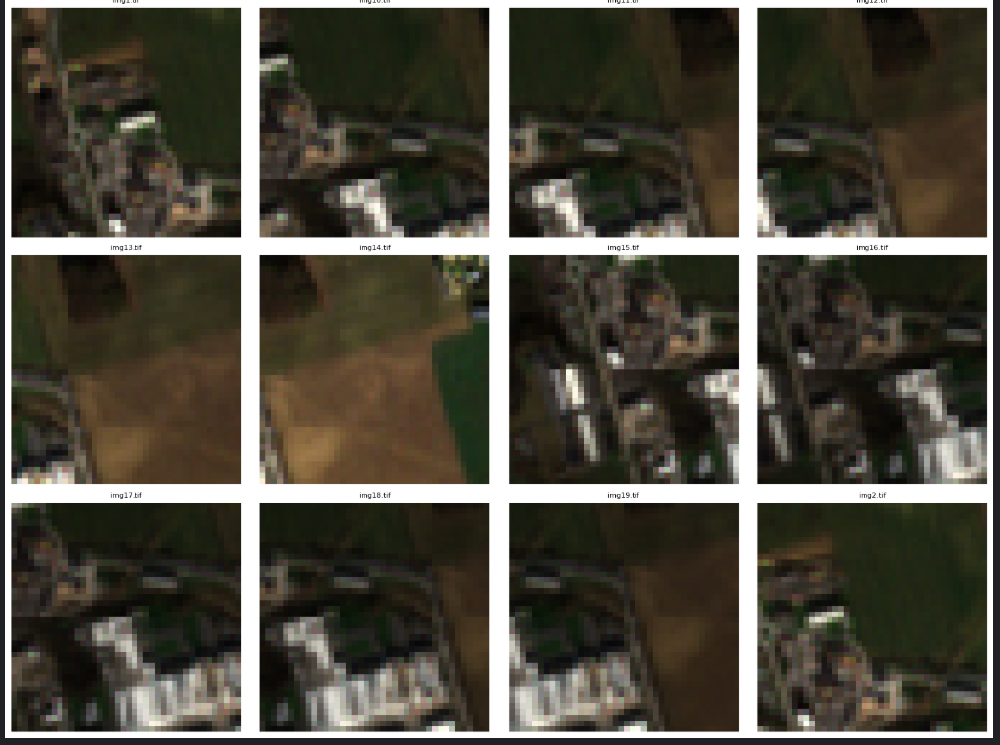
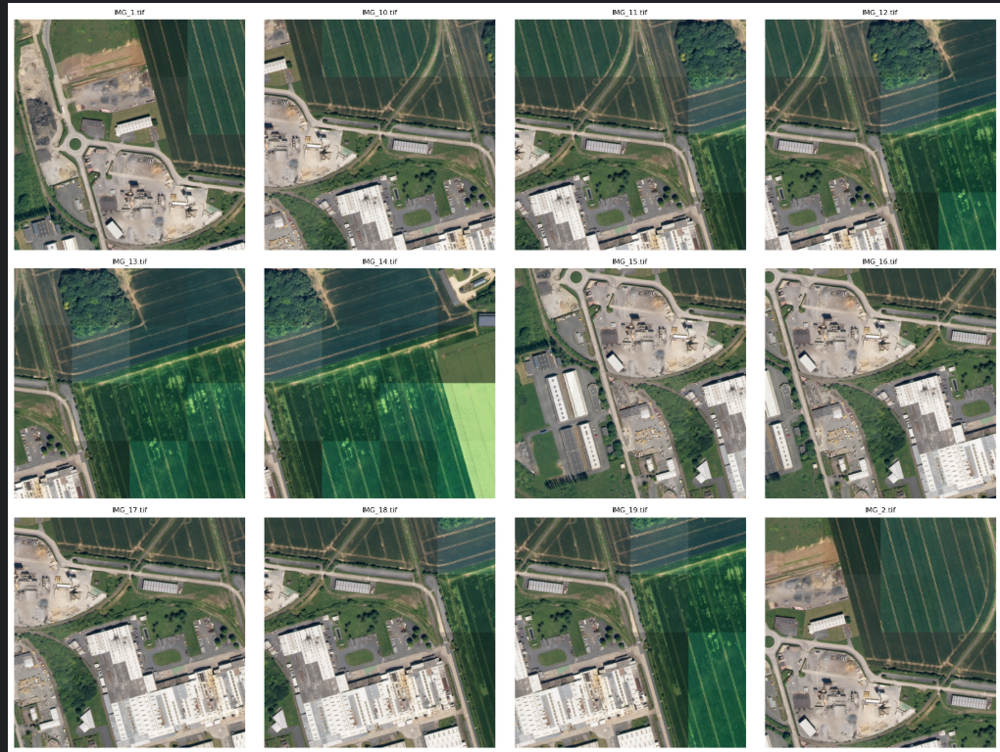
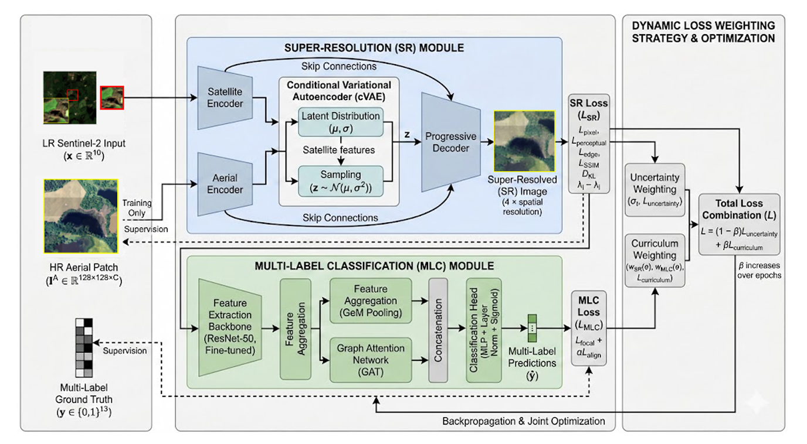

# Joint Super-Resolution and Multi-Label Classification for Remote Sensing Imagery - 2025

## 📌 Overview

This repository presents a **joint deep learning framework** that integrates  
**Satellite Image Super-Resolution (SR)** and **Multi-Label Classification (MLC)**  
for remote sensing imagery.

The proposed pipeline enhances spatial resolution of low-quality satellite images
while simultaneously performing land-cover classification. This joint formulation
enables accurate semantic understanding under severe resolution constraints using the high resolution images as an intermediate images for training.

---
##  Dataset Description

This work uses the **FLAIR-2 dataset**, which provides paired remote sensing data
with semantic annotations. The dataset includes **Sentinel-2 images at 10 m spatial
resolution**, along with corresponding **high-resolution aerial imagery at 0.2 m
resolution** and associated land-cover labels.

The Sentinel-2 images serve as the low-resolution inputs for the proposed framework,
while the high-resolution imagery and annotations enable learning for both
super-resolution and multi-label classification tasks. Prior to training, the dataset
was preprocessed by **stitching the low-resolution images into 4×4 grids** from
original 10×10 tiles, and the corresponding high-resolution images were similarly
stitched into 4×4 grids. This spatial alignment between low- and high-resolution
images facilitates controlled analysis of resolution enhancement and accurate
semantic prediction from degraded inputs.


Shown are example image pairs from the dataset illustrating the correspondence between
low-resolution Sentinel-2 inputs and high-resolution aerial imagery. Multiple cropped
regions are included in each image to capture diverse land-cover structures and
demonstrate the level of spatial detail available at different resolutions.
<p align="center">
  <br>
  
</p>

<p align="center">
  <b>Low-Resolution Sentinel-2 (10 m)</b><br>
  <b>High-Resolution Aerial Imagery (0.2 m)</b>
</p>


## ✨ Key Contributions

- **Joint SR–MLC Framework** enabling simultaneous image enhancement and semantic understanding
- **Progressive Three-Stage Training Strategy** for stable and effective optimization
- **Feature-Space Super-Resolution** using a Conditional Variational Autoencoder (CVAE)
- **Graph-Based Multi-Label Classification** modeling spatial and label dependencies
- **Comprehensive Evaluation** using reconstruction and classification metrics

---

##  Overall Architecture

<p align="center">
  
</p>

<p align="center">
  <em>Overview of the proposed joint Super-Resolution and Multi-Label Classification pipeline.</em>
</p>

The framework consists of a super-resolution branch that reconstructs high-resolution
feature representations and a classification branch that exploits spatial and label
relationships. Both components are jointly optimized to improve performance under
low-resolution conditions.

---

##  Model Components

### 1️⃣ Super-Resolution Module (SR_Feature_CVAE)

- Improved VGG-based feature encoder
- Conditional Variational Autoencoder (CVAE) for feature-space modeling
- Multi-objective reconstruction loss:
  - Perceptual loss
  - Edge-aware loss
  - SSIM loss

This design enables robust recovery of fine spatial details from severely degraded inputs.

---

### 2️⃣ Multi-Label Classification Module (DualGNNModel)

- ResNet50 backbone with **GeM pooling**
- Patch-level Graph Neural Network (GNN) for spatial reasoning *(optional)*
- Label Graph Neural Network for modeling label co-occurrence *(optional)*
- **Layer Normalization** replaces Batch Normalization for improved stability

---

### 3️⃣ Joint Model (JointSRMLC)

- Integrates SR and MLC modules into a unified architecture
- Supports three operating modes:
  - `sr_only`
  - `mlc_only`
  - `joint`

---

## 📈 Training Strategy

The model is trained using a **three-stage progressive learning scheme**:

1. **Stage I - Super-Resolution Pretraining**  
   The SR module is trained independently to ensure stable feature reconstruction.

2. **Stage II - Classification Pretraining**  
   The MLC module is optimized using enhanced feature representations.

3. **Stage III - Joint Fine-Tuning**  
   End-to-end training with adaptive multi-task loss balancing.

This strategy improves convergence stability and overall generalization.

---


The figure illustrates six representative image patches comparing low-resolution (LR)
inputs with their corresponding high-resolution (HR) ground truth images. The LR images
exhibit significant loss of structural and textural details, highlighting the challenges
addressed by the proposed super-resolution framework.

---

## 📊 Evaluation Metrics

### Super-Resolution
- PSNR
- SSIM

### Multi-Label Classification
- Precision
- Recall
- F1-score
- Mean Average Precision (mAP)

---

# 📊 Results and Analysis

## Super-Resolution Performance on the FLAIR-2 Dataset

| Model | PSNR ↑ | SSIM ↑ |
|:------|:------:|:------:|
| Bicubic [17] | 24.51 | 0.728 |
| RCAN [18] | **27.85** | **0.814** |
| ESRGAN [19] | 26.12 | 0.789 |
| LDM-SR [20] | 25.78 | 0.765 |
| Proposed (SR-only) | 27.40 | 0.766 |
| Proposed (SR+MLC Joint) | 24.68 | 0.682 |

The proposed framework achieves competitive reconstruction performance while simultaneously enabling downstream semantic understanding. The joint optimization setting introduces a trade-off between image fidelity and classification objectives, resulting in task-aware feature representations for remote sensing analysis.

---

## Multi-Label Classification on SR-Reconstructed FLAIR-2 Test Set (13 Classes)

| Model | Micro-F1 ↑ | Macro-F1 ↑ | mAP ↑ | Hamming Loss ↓ |
|:------|:-----------:|:-----------:|:-----:|:--------------:|
| Bicubic [17] | 0.685 | 0.523 | 0.601 | 0.246 |
| RCAN [18] | 0.812 | **0.689** | 0.752 | **0.129** |
| ESRGAN [19] | 0.776 | 0.645 | 0.712 | 0.153 |
| LDM-SR [20] | 0.742 | 0.601 | 0.676 | 0.170 |
| Proposed (SR-only) | 0.799 | 0.642 | 0.738 | 0.146 |
| Proposed (Joint SR+MLC) | **0.853** | 0.657 | **0.765** | 0.140 |

The proposed **Joint SR+MLC framework** achieves the highest **Micro-F1 score (0.853)** and **mAP (0.765)**, demonstrating that integrating super-resolution and multi-label classification in a unified architecture significantly improves semantic understanding of low-resolution remote sensing imagery.

---

# 🏆 Publication

This work is associated with our paper published at the **IEEE/CVF Winter Conference on Applications of Computer Vision (WACV) Workshops 2026**, a leading international venue in computer vision and pattern recognition.

### 📄 Multi-Label Classification in Remote Sensing: Leveraging High-Resolution Patches for Low-Resolution Tasks

**Authors:**  
Shreya Pandey, **Pragna Echuri**, Vishnu Meher Vemulapalli, Shounak Chakraborty

**Publication:**  
*Proceedings of the IEEE/CVF Winter Conference on Applications of Computer Vision (WACV) Workshops, 2026, pp. 1512–1520.*

**Paper:**  
[https://openaccess.thecvf.com/content/WACV2026W/CV4EO/html/Pandey_Multi-Label_Classification_in_Remote_Sensing_Leveraging_High-Resolution_Patches_for_Low-Resolution_WACVW_2026_paper](https://openaccess.thecvf.com/content/WACV2026W/CV4EO/html/Pandey_Multi-Label_Classification_in_Remote_Sensing_Leveraging_High-Resolution_Patches_for_Low-Resolution_WACVW_2026_paper.html)

## Citation

```bibtex
@InProceedings{Pandey_2026_WACVW,
    author    = {Pandey, Shreya and Echuri, Pragna and Vemulapalli, Vishnu Meher and Chakraborty, Shounak},
    title     = {Multi-Label Classification in Remote Sensing: Leveraging High-Resolution Patches for Low-Resolution Tasks},
    booktitle = {Proceedings of the IEEE/CVF Winter Conference on Applications of Computer Vision (WACV) Workshops},
    year      = {2026},
    pages     = {1512--1520}
}
```

If you find this repository useful in your research, please consider citing our work.
